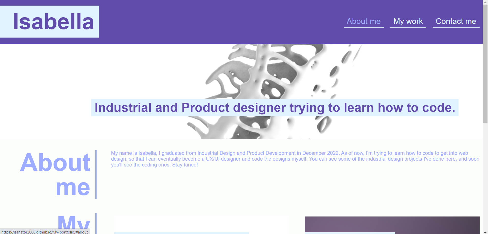
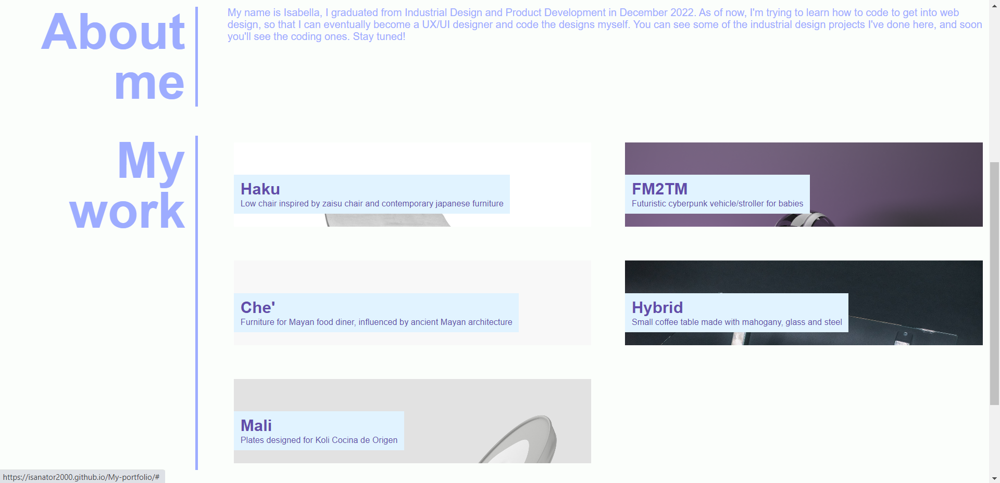
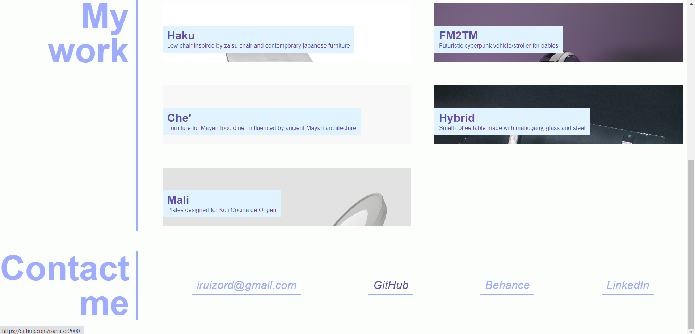
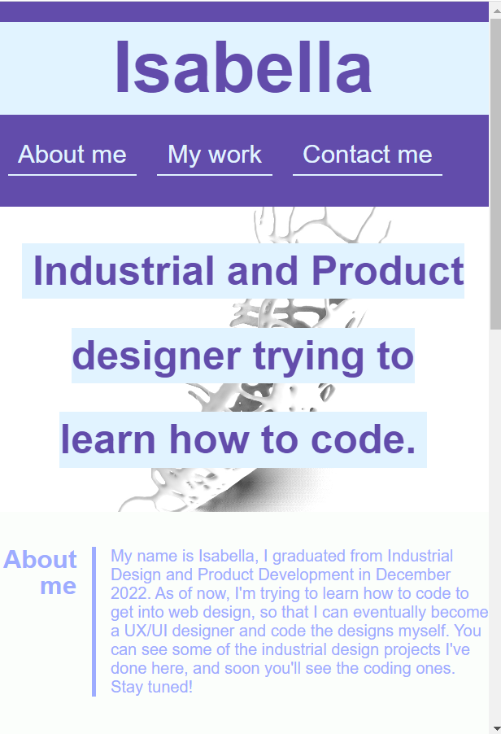
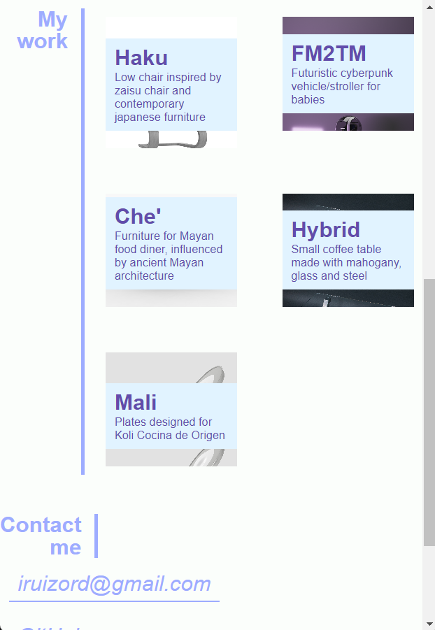
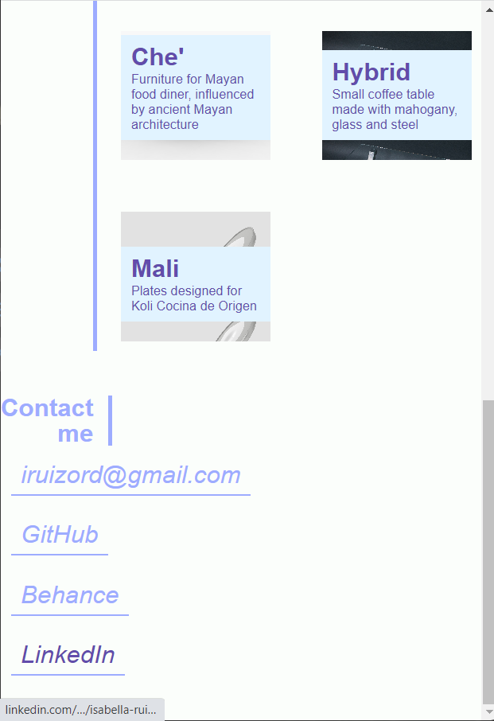

# My portfolio

## Description

This is my portfolio page, created with the main objective of showcasing some of the work I've done so potential employers can see it.
It includes a header with my name and links to the corresponding sections of the page, a small About me section with some information, 
and some placeholder projects I've done (unrelated to coding), that I'll eventually replace with projects/pages/applications done in the web dev bootcamp I'm currently in. 

## Usage

To navigate through this webpage, you can click on the navigation elements displayed in the header bar. Doing so will take you to the corresponding section in the page.

[My portfolio page](https://isanator2000.github.io/My-portfolio/)

## Notes
I want to credit my peer Alejandro Lopez, who during a study group session explained to me how to use grid properties to display the projects in the My work section, 
and helped me implement it in my code. That part of the code is in the css file, in the .flex-container selector.
